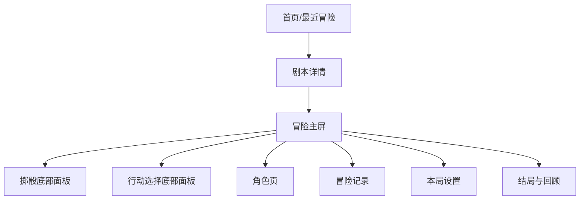
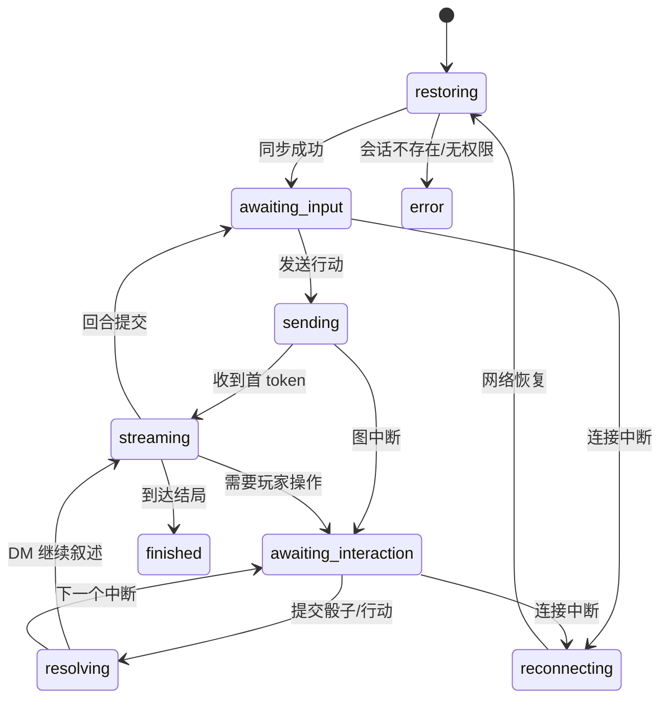

# 小程序 UI 设计方案

> 方案基线：2026-07-14。
> 目标：把现有 PC 垂直切片改造成适合手机单手操作、可中断恢复的微信小程序体验。

## 一、设计判断

小程序不应直接缩放当前 PC 双栏页面。手机上的主任务始终只有一个：**读 DM 叙述，然后完成当前轮到自己的动作。** 场景、角色、敌人和日志是辅助信息，应按状态露出，而不是永久占据半屏。

推荐采用“叙事主屏 + 战斗模式切换”的方案：

- 探索时以时间线和输入框为主，场景图建立氛围。
- 需要掷骰或选行动时，底部操作面板自动抬起，替代文本输入。
- 进入战斗后，顶部变为紧凑战况条，时间线仍保留 DM 叙述。
- 角色详情、规则解释、完整日志放到二级页面或抽屉。

## 二、用户与核心场景

### 目标用户

- 第一次接触跑团：需要明确“现在能做什么”和结果反馈。
- 熟悉 TRPG 的玩家：需要看到骰值、加值、DC/AC、行动目标和状态来源。
- 单人碎片时间玩家：可能频繁切后台，恢复必须可靠。
- 后续多人玩家：只在轮到自己时出现主操作，其他时间能旁观叙述和战况。

### 核心任务

1. 继续最近一局或开始短冒险。
2. 阅读流式 DM 叙述。
3. 输入自然语言行动。
4. 完成属性检定、先攻、攻击和伤害掷骰。
5. 在战斗中选择攻击、技能、道具、移动、创意或放弃。
6. 查看角色 HP、状态、装备和最近结算。
7. 断线/切后台后回到准确的待处理动作。

## 三、三种 UI 方向

| 方案 | 视觉与布局 | 优点 | 风险 | 结论 |
| --- | --- | --- | --- | --- |
| A. 叙事卷轴 | 场景图 + 连续 DM 时间线 + 固定输入区 | 沉浸强，探索/社交自然，最符合 AI DM 价值 | 战斗信息可能藏得太深 | 推荐作为常态主屏 |
| B. 战术控制台 | 角色/敌人/行动优先，叙述作为战报 | 战斗操作快，数值透明 | 探索像数值游戏，削弱叙事 | 仅在 combat 状态启用 |
| C. 极简聊天 | 类即时通讯，所有操作发卡片消息 | 开发快、学习成本低 | 角色与战况弱，容易像普通聊天机器人 | 可做低成本原型，不做最终方向 |

**最终建议：A 为基础，进入战斗后局部切换为 B。** 不做两套页面，使用同一时间线，只替换顶部状态区和底部操作区。

## 四、信息架构



推荐页面：

```text
pages/home/index                 最近一局、开始冒险
pages/campaign/index             剧本说明、时长、规则标签
pages/adventure/index            核心体验
pages/character/index            角色卡、技能、物品、状态
pages/journal/index              分页时间线与结算日志
pages/ending/index               结局、关键选择、再次开始
```

掷骰和行动选择不是独立页面，而是 `adventure` 内的底部面板，避免页面跳转打断回合。

## 五、推荐主屏线框

### 1. 探索/社交状态

```text
┌──────────────────────────────┐
│  场景图：破钟酒馆             │  168rpx，真实场景资产
│  钟楼下的低语                 │  标题压在图上，不放卡片
│  破钟酒馆 · 夜雨              │
├──────────────────────────────┤
│ 艾莉亚  HP 30/30      等待玩家 │  紧凑状态条
├──────────────────────────────┤
│ DM                            │
│ 村长把一枚染血的铜铃推到你面前…│
│ 你可以检查铜铃、询问失踪者，   │
│ 或前往钟楼。                  │
│                               │
│                    玩家       │
│          我先检查铜铃上的痕迹。│
│                               │
│ DM 正在回应…                  │  流式内容直接生长
│                               │
├──────────────────────────────┤
│ ＋  描述你的行动…        [发送]│  固定底部，适配安全区
└──────────────────────────────┘
```

要点：

- 场景图不是装饰背景，必须对应 `location_id/beat_id`，让玩家知道自己在哪里。
- 不显示内部“当前拍 ID”“节点名”等开发字段。
- DM 消息左对齐，玩家消息右对齐；不使用大气泡卡片，保持长文本阅读宽度。
- DM 给出的“你可以……”可解析成 2-3 个快捷建议 chip，但始终保留自由输入。

### 2. 明检定状态

```text
┌──────────────────────────────┐
│ 上方仍是冒险时间线             │
│ …                             │
├──────────────────────────────┤
│ 感知检定                 DC 13 │
│ 检查铜铃边缘残留的黑色粉末      │
│                              │
│          [ d20 图形 ]         │
│           尚未掷骰            │
│                              │
│ 固定加值  +1                  │
│ [掷虚拟骰]      [录入实体骰]    │
└───────────安全区──────────────┘
```

交互：

- 面板出现后禁用自由输入，主按钮只有一个明确动作。
- “掷虚拟骰”由服务端生成结果，前端只做动画；不能用 `Math.random()` 作为可信结算。
- “录入实体骰”展开数字步进器 1-20，提交前显示“原始骰 + 引擎加值”。
- 结果动画控制在 600-900ms，之后立即展示 `d20 + bonus = total / DC`，DM 叙述继续流式到时间线。

### 3. 战斗状态

```text
┌──────────────────────────────┐
│ 第 2 轮       轮到：艾莉亚     │
│ 艾莉亚  ███████░ 22/30  AC16  │
│ 哥布林  ███░░░░░  4/12  AC13  │
├──────────────────────────────┤
│ DM 战报时间线                  │
│ 斥候的弯刀擦过你的护肩……       │
│                              │
├──────────────────────────────┤
│ [攻击] [技能] [道具] [移动]     │  分段控制
│ ──────────────────────────── │
│ 长剑                          │
│ 目标：哥布林·斥候  前排         │
│ 命中 +6 · 伤害 1d8+4          │
│                       [确认]  │
└───────────安全区──────────────┘
```

要点：

- 顶部只显示当前行动者和最相关的存活单位；完整先攻顺序横向滚动或从详情打开。
- 行动类型使用图标 + 短标签的分段控制，不把所有动作平铺成一堆按钮。
- 先选行动，再选目标，最后确认。不可达目标直接禁用并解释原因。
- “创意行动”位于更多菜单，打开后输入描述；DC 和属性由 DM 决定，玩家不能从请求里任意提交。
- 不是自己回合时，底部显示“等待某某行动”，仍可查看角色和日志。

### 4. 结局状态

```text
┌──────────────────────────────┐
│ 结局场景图                    │
│ 钟声终于停了                  │
├──────────────────────────────┤
│ DM 结局叙述                   │
│                              │
│ 本局 18 分钟 · 7 次检定        │
│ 关键选择：保留铜铃 / 救出守钟人 │
│                              │
│ [查看冒险记录]  [再次开始]      │
└──────────────────────────────┘
```

不要用“恭喜通关”覆盖故事情绪。先完整展示结局叙述，再给统计和操作。

## 六、页面规格

### 1. 首页

首页直接服务于继续游戏，不做营销落地页。

- 第一屏顶部显示产品名和用户头像。
- 最近冒险占主区域：剧本图、当前地点、最后更新时间、状态和“继续”。
- 下方是可开始的短剧本列表，每项展示预计时长、人数、规则复杂度和完成状态。
- 没有历史时，第一张内容就是“钟楼下的低语”，主按钮为“开始冒险”。

### 2. 冒险主屏

- 场景媒体区：进入地点时展开，向下滚动后收成 88rpx 标题栏。
- 时间线：只渲染公开消息和结构化结算；长局按游标向上加载。
- 输入区：文本、语音入口、快捷建议、发送。MVP 可先不实现语音识别，但预留图标位置。
- 状态入口：角色头像显示 HP 环；敌人入口只在战斗/明确威胁时出现。
- 网络状态：断线时输入保留本地草稿，顶部显示非阻塞状态条；恢复后先同步 revision。

### 3. 角色页

首屏只放高频信息：

- 头像、姓名、种族/职业/等级。
- HP、AC、六维调整值、熟练加值。
- 当前状态和剩余资源。
- 技能、攻击、背包使用标签页切换。

角色详情是信息页面，不把每个属性做成独立浮动卡片。用分隔线、表格行和进度条组织。

### 4. 冒险记录

- “叙事 / 骰子与规则”两个标签。
- 叙事视图只看 DM 与玩家消息。
- 规则视图显示结构化事件：谁掷了什么、原始骰、加值、目标值、结果、HP 变化。
- 支持按回合、战斗和剧情地点定位，不暴露系统提示词、模型思考或 canon 秘密。

## 七、组件与状态

### 核心组件

| 组件 | 职责 |
| --- | --- |
| `SceneHeader` | 场景资产、剧本名、地点、网络状态。 |
| `AdventureTimeline` | 分页消息、流式消息、自动滚动和新消息提示。 |
| `Composer` | 自由输入、草稿、快捷建议、发送。 |
| `PendingInteractionSheet` | 根据中断类型选择 Dice、Action、Target 或 Damage 子面板。 |
| `CombatStatusBar` | 轮次、行动者、队伍/敌人 HP、先攻入口。 |
| `ResolutionInline` | 检定公式、伤害、治疗和状态变化。 |
| `ConnectionBanner` | 重连、同步、冲突和失败后的恢复动作。 |

### 前端状态机



UI 必须由这个显式状态机驱动，不能只依赖 `isLoading + payload` 两个布尔组合。

## 八、视觉规范

### 色彩

避免整页仿羊皮纸、深蓝或棕色一色到底。推荐中性明亮底色配多色功能语义：

| Token | 建议值 | 用途 |
| --- | --- | --- |
| `canvas` | `#F5F7F4` | 页面背景 |
| `surface` | `#FFFFFF` | 输入区、底部面板 |
| `ink` | `#17201E` | 主文字 |
| `muted` | `#66716E` | 次级信息 |
| `line` | `#D8DEDA` | 分隔线 |
| `brand` | `#226A5A` | 主操作、探索状态 |
| `danger` | `#A13F47` | 受伤、敌对、失败 |
| `arcane` | `#5867A8` | 法术、DM/系统状态 |
| `warning` | `#B67820` | 等待掷骰、风险提示 |

颜色不能独立表达成功/失败，必须同时有文字或图标。

### 字体和密度

- 正文 30-32rpx，行高 1.65，适合长叙述。
- 页面标题 38-42rpx；面板标题 30-32rpx，不在紧凑控件里用大字。
- 数值使用等宽数字特性，避免 HP 和骰值跳动。
- 触控目标至少 88rpx 高；图标按钮必须有无障碍名称。
- 卡片圆角不超过 16rpx（约 8px）；时间线和页面分区优先用留白/分隔线，不层层套卡片。

### 视觉资产

- 每个主要 `location_id` 配一张可辨识的横向场景图；第一版使用人工审核的静态资产映射。
- 角色和怪物使用头像或半身像，不能只用首字母圆圈。
- 骰子可用现有 d4-d20 资产，但动画只服务于反馈，不延迟真实结果。
- 图片必须有占位色和失败态；不让网络图片加载改变固定布局高度。

## 九、骰子方案

提供两种互斥模式，由房间在开局时确定：

### 虚拟骰（推荐默认）

1. 玩家点击“掷骰”。
2. 服务端为当前 interrupt 产生原始骰并记录 seed/roll index/source。
3. 小程序播放短动画，同时收到最终数值。
4. 服务端将该数值作为本次 resume 的可信输入继续图。

### 实体骰

1. 玩家选择“录入实体骰”。
2. 输入 1-20 或对应伤害骰总和。
3. UI 显示原始值和引擎将添加的固定加值。
4. 结果日志标记 source=`manual`；多人房间由房主决定是否允许。

无论哪种模式，加值、DC/AC 比较、重击和伤害应用仍由引擎完成。

## 十、后端协议依赖

小程序开发前建议先提供以下公开协议，避免直接绑定 `DMState`：

```json
{
  "session_id": "session_demo_01",
  "revision": 17,
  "status": "awaiting_interaction",
  "campaign": { "id": "whispers_bell_tower", "title": "钟楼下的低语" },
  "scene": {
    "location_id": "broken_bell_tavern",
    "name": "破钟酒馆",
    "image_key": "scene/broken_bell_tavern",
    "threat_level": "low"
  },
  "timeline": [],
  "party": [],
  "enemies": [],
  "pending_interaction": null,
  "recent_resolution": null
}
```

事件 envelope：

```json
{
  "event_id": "evt_...",
  "session_id": "session_demo_01",
  "request_id": "req_...",
  "revision": 17,
  "type": "narration.delta",
  "payload": { "message_id": "msg_...", "text": "钟声" }
}
```

命令至少包括：

- `POST /sessions`：创建一局。
- `GET /sessions/{id}`：恢复统一 SessionView，包含 pending interaction。
- `POST /sessions/{id}/commands`：发送自然语言或提交交互，带 request_id 和 expected_revision。
- `GET /sessions/{id}/timeline?cursor=`：历史分页。
- 事件连接：鉴权后按 session 订阅，支持携带 last_event_id 补事件。

## 十一、实施拆分

### 第一批：可玩骨架

- 首页最近一局、剧本详情、冒险主屏。
- SessionView 恢复、文本输入、流式叙述。
- d20 检定面板、攻击/移动/放弃。
- 战况条、角色基础页、结局页。

### 第二批：动作完整性

- 技能、道具、目标选择、伤害骰、创意行动。
- 历史分页、规则日志、静态场景资产。
- 断线补事件、错误恢复、请求幂等提示。

### 第三批：多人准备

- 房间邀请、成员列表、当前操作者。
- 旁观状态、催办但不代掷、掉线席位保留。
- 多人投票或房主裁决只在明确产品需求后加入。

## 十二、UI 验收清单

- 在 320x568、375x812、430x932 等窄/长屏上无文字或按钮重叠。
- 底部输入和交互面板正确避开 iPhone 安全区与微信胶囊区域。
- 键盘弹起后，当前操作和最新 DM 消息仍可见。
- 200% 长文本、最长角色名和最长地点名不会撑坏布局。
- 流式消息不会导致输入区、战况条或骰子控件跳动。
- 所有中断类型都有完整操作，不存在只能通过手写 JSON 完成的分支。
- 刷新、切后台、断网后能恢复 pending interaction 和本地草稿。
- 旧 revision、重复事件和重复点击不会在 UI 产生重复消息或重复结算。
- 场景图、角色图和骰子资产在真机弱网下有稳定占位，不出现空白首屏。
- 调试节点、系统提示词、canon 秘密和模型内部消息不会出现在玩家版本。
