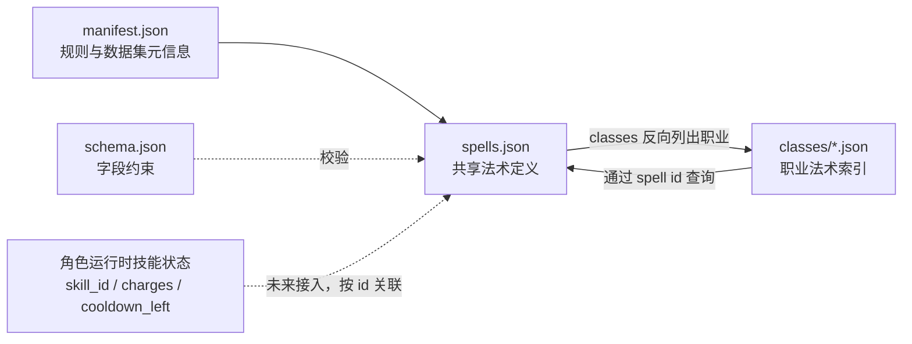

# `dnd_skill` 职业法术数据说明

> 本文解释 `dnd_skill/` 中各文件的职责、相互关系、字段语义和后续接入边界。
> 数据来源是 `pdf/5eDnD_玩家手册PHB_中译v1.72版.pdf` 第 11 章。

## 1. 数据集解决什么问题

`dnd_skill/` 是一套从 PHB 提取的**静态法术目录**，用于回答：

- 一个职业可以使用哪些法术；
- 一个法术属于哪些职业、最低环位和学派；
- 法术属于伤害、治疗、控制等哪些用途；
- 按项目规则把法术位换算成多少个自身回合的冷却；
- 法术是否需要专注，以及伤害或治疗如何计算。

当前数据只覆盖拥有独立 PHB 职业法术表的 8 个职业，不包含野蛮人、战士、武僧、游荡者，也不展开奥法骑士、诡术师等子职业的选法术规则。

当前规模：

| 项目 | 数量 |
|---|---:|
| 职业 | 8 |
| 唯一法术 | 361 |
| 职业与法术的归属关系 | 845 |

## 2. 目录与职责

```text
dnd_skill/
├── manifest.json          # 数据来源、数量、类型字典、冷却规则
├── schema.json            # spells.json 的 JSON Schema
├── spells.json            # 361 个共享法术定义，唯一事实来源
└── classes/
    ├── bard.json          # 吟游诗人法术索引
    ├── cleric.json        # 牧师法术索引
    ├── druid.json         # 德鲁伊法术索引
    ├── paladin.json       # 圣武士法术索引
    ├── ranger.json        # 游侠法术索引
    ├── sorcerer.json      # 术士法术索引
    ├── warlock.json       # 邪术师法术索引
    └── wizard.json        # 法师法术索引
```

各文件的职责如下：

- [`manifest.json`](../../dnd_skill/manifest.json)：数据集入口，记录版本、范围、数量、分类枚举和冷却换算规则。
- [`schema.json`](../../dnd_skill/schema.json)：约束 `spells.json` 的字段、类型、必填项和枚举值。
- [`spells.json`](../../dnd_skill/spells.json)：共享法术定义。法术名称、职业归属、专注和计算规则均以这里为准。
- [`classes/`](../../dnd_skill/classes)：按职业和最低环位组织的查询索引，只保存法术 ID 与便于展示的中英文名。

## 3. 数据关系

一个法术可以属于多个职业，一个职业也拥有多个法术，因此职业和法术是**多对多关系**。



关系中的关键约定：

1. `spells.json` 是法术详情的唯一事实来源。
2. `classes/{class_id}.json` 是查询索引，不应复制或覆盖法术机械规则。
3. 职业索引中的 `id` 必须能在 `spells.json` 找到。
4. `spells.json` 中每个法术的 `classes` 必须与各职业索引反向一致。
5. 职业索引按法术的**最低环位**分组；升环施法不会改变它所在的索引分组。

例如，`fireball` 同时属于 `sorcerer` 和 `wizard`：

- `spells.json` 中只有一条 `fireball` 定义，其 `classes` 为 `["sorcerer", "wizard"]`；
- `classes/sorcerer.json` 和 `classes/wizard.json` 的 `spells_by_level["3"]` 都引用 `fireball`；
- 修改火球术的伤害公式时只修改共享定义，不能在两个职业文件里各维护一份。

## 4. 职业索引结构

每个职业文件结构相同：

```json
{
  "class_id": "wizard",
  "class_name_zh": "法师",
  "class_name_en": "Wizard",
  "spell_count": 215,
  "spells_by_level": {
    "0": [
      {
        "id": "acid_splash",
        "name_zh": "酸液飞溅",
        "name_en": "Acid Splash"
      }
    ]
  }
}
```

字段说明：

| 字段 | 含义 |
|---|---|
| `class_id` | 稳定职业 ID，用于程序关联 |
| `class_name_zh` / `class_name_en` | 展示名称 |
| `spell_count` | 该职业索引中的法术总数 |
| `spells_by_level` | 按最低环位分组的法术引用；`"0"` 表示戏法 |
| 法术引用中的 `id` | 连接到 `spells.json` 的主键 |
| 法术引用中的名称 | 冗余展示信息，不是详情事实来源 |

职业 ID 与当前法术数量：

| `class_id` | 职业 | 法术数 |
|---|---|---:|
| `bard` | 吟游诗人 | 120 |
| `cleric` | 牧师 | 106 |
| `druid` | 德鲁伊 | 110 |
| `paladin` | 圣武士 | 45 |
| `ranger` | 游侠 | 46 |
| `sorcerer` | 术士 | 129 |
| `warlock` | 邪术师 | 74 |
| `wizard` | 法师 | 215 |

这些数量不能相加得到唯一法术数，因为同一个法术可能被多个职业引用。

## 5. 共享法术字段

`spells.json` 是法术对象数组。每个对象包含以下字段：

| 字段 | 含义 |
|---|---|
| `id` | 稳定英文 snake_case ID，也是职业索引的关联键 |
| `name_zh` / `name_en` | PHB 中英文名称 |
| `level` | 最低法术环位；`0` 表示戏法 |
| `school` / `school_zh` | 英文学派枚举与中文展示值 |
| `ritual` | PHB 是否标记为仪式法术 |
| `source_page` | PDF 中法术详述所在页，用于回查原文 |
| `classes` | 可以学习或准备该法术的职业 ID 列表 |
| `types` | 用途标签列表，一个法术可以有多个标签 |
| `cooldown_rounds` | 按最低环位计算的基础冷却 |
| `concentration` | 是否需要专注 |
| `duration` | PHB 持续时间文本；专注法术会包含“专注” |
| `damage_calculation` | 伤害计算；不造成伤害时为 `null` |
| `healing_calculation` | 治疗或复活计算；没有此效果时为 `null` |

### 5.1 法术学派

| `school` | 中文 |
|---|---|
| `abjuration` | 防护 |
| `conjuration` | 咒法 |
| `divination` | 预言 |
| `enchantment` | 附魔 |
| `evocation` | 塑能 |
| `illusion` | 幻术 |
| `necromancy` | 死灵 |
| `transmutation` | 变化 |

### 5.2 用途类型

`types` 是多选标签，不是互斥枚举。例如一个法术可以同时为 `damage` 和 `control`。

| 类型 | 中文含义 | 典型效果 |
|---|---|---|
| `damage` | 伤害 | 伤害骰、固定伤害、生命值阈值即死 |
| `healing` | 治疗或复活 | 恢复生命、复活、解除严重负面状态 |
| `control` | 控制 | 定身、魅惑、减速、击退、限制行动 |
| `defense` | 防御 | AC、抗性、免疫、护盾、伤害防护 |
| `buff` | 增益 | 优势、加值、属性或行动强化 |
| `mobility` | 机动 | 飞行、传送、移动方式变化 |
| `summoning` | 召唤 | 召唤或创造可独立行动的生物/仆从 |
| `exploration` | 探索或通用 | 侦测、交流、幻象、创造和场景工具 |

不要根据法术学派推导用途类型。例如防护学派法术不一定只是 `defense`，塑能学派法术也不一定都造成伤害。

## 6. 冷却规则

项目不使用 PHB 法术位，而把施法资源改为按施法者自身回合计算的冷却：

| 施放方式 | 冷却 |
|---|---:|
| 戏法 | `0` |
| 按最低环位施放 | 等于法术 `level` |
| 升环施放 | 等于实际施放环位 |

例如：

- 火球术最低为 3 环，因此静态定义中 `cooldown_rounds = 3`；
- 如果按 5 环施放火球术，本次运行时冷却应使用 `5`，而不是静态字段中的 `3`；
- 戏法的 `cooldown_rounds = 0`，可以在满足行动条件时重复使用。

`cooldown_rounds` 是**法术定义上的基础值**，不能在战斗过程中修改。角色身上的剩余冷却属于运行时状态，应写入类似 `LearnedSkill.cooldown_left` 的字段。

当前数据只规定冷却单位为 `actor_turn`，未规定是在回合开始还是回合结束递减。接入引擎时必须统一选择一个时点，并用测试锁定，避免客户端与后端相差一回合。

## 7. 伤害与治疗计算

### 7.1 `damage_calculation`

```json
{
  "base": ["8d6"],
  "method": "dexterity_save",
  "on_save": "half",
  "scaling": "每高于 3 环一环，伤害增加 1d6。",
  "details": "区域内目标进行敏捷豁免；失败受到完整伤害，成功减半。"
}
```

字段含义：

| 字段 | 含义 |
|---|---|
| `base` | 基础骰式或特殊计算。数组中出现多个值时必须结合 `details` 判断关系，不能默认全部相加 |
| `method` | 主要伤害判定方式 |
| `on_save` | 豁免成功后的伤害结果 |
| `scaling` | 戏法等级成长或升环变化；没有成长时为 `null` |
| `details` | 多目标、多段、持续触发、伤害类型等必要说明 |

`method` 当前可能值：

- `spell_attack`：法术攻击检定；
- `strength_save`、`dexterity_save`、`constitution_save`、`intelligence_save`、`wisdom_save`、`charisma_save`：对应属性豁免；
- `automatic`：自动命中或满足阈值后自动生效；
- `special`：无法简化为单次攻击或豁免，需要按 `details` 处理。

`on_save` 当前可能值：

- `half`：成功时伤害减半；
- `none`：成功时不受该伤害；
- `see_details`：豁免与伤害/附带效果关系较复杂，必须读取 `details`；
- `null`：没有伤害豁免，例如法术攻击或自动生效。

`base: ["special"]` 表示没有普通伤害骰。当前典型例子是圣言术和律令死亡，它们按目标当前生命值阈值结算。

### 7.2 `healing_calculation`

治疗结构主要使用：

- `base`：基础治疗骰或 `special`；
- `scaling`：升环后的治疗变化；
- `details`：目标、生命值上限变化、复活条件等规则。

治疗分类与治疗计算不是严格一一对应。例如次级复原术属于 `healing`，但它解除状态而不直接恢复生命值，因此 `healing_calculation` 可以是 `null`。

### 7.3 结构化程度边界

`base`、`method` 和 `on_save` 适合程序读取；`scaling` 与 `details` 仍是中文规则摘要。运行时会把这些规则事实交给真实 LLM，编译为受版本和白名单约束的效果计划；LLM 不掷骰、不计算最终 HP，引擎也不会通过解析自然语言直接扣 HP。

要接入确定性战斗结算，应进一步把法术转换为效果积木，例如：

- 攻击或豁免；
- 伤害/治疗骰；
- 目标数量和作用范围；
- 状态及持续回合；
- 回合开始、进入区域或命中后的触发时机。

## 8. 推荐读取流程

后端或工具读取某职业法术时建议：

1. 加载 `manifest.json`，确认 `schema_version` 和冷却规则。
2. 加载 `spells.json`，建立 `{spell_id: spell}` 映射。
3. 加载目标职业的 `classes/{class_id}.json`。
4. 从 `spells_by_level` 取得法术 ID，再到共享映射查询完整定义。
5. 根据角色等级、已学/已准备法术、用途类型和运行时冷却过滤可用项。

Python 示例：

```python
import json
from pathlib import Path

root = Path("dnd_skill")
spells = json.loads((root / "spells.json").read_text(encoding="utf-8"))
spell_by_id = {spell["id"]: spell for spell in spells}

wizard = json.loads(
    (root / "classes" / "wizard.json").read_text(encoding="utf-8")
)
level_three = [
    spell_by_id[item["id"]]
    for item in wizard["spells_by_level"]["3"]
]
```

不要用职业索引中的冗余名称反向匹配法术，也不要把中文名当主键；关联必须使用 `id`。

## 9. 与当前战斗模型的集成

`dnd_skill/` 已接入角色成长和战斗行动：

- `src/character/skills.py` 以法术 ID 为唯一关联键，按职业和角色等级自动生成 `LearnedSkill`；
- `src/character/features.py` 用注册表和机械 hook 管理 AC、冷却覆盖、主动技能、通用动作与额外攻击；
- `LearnedSkill` 保存展示名、来源类型、解锁等级、充能、冷却和技能分类；`charges=None` 表示无限次；
- `src/combat/skill_resolver.py` 使用代码内置系统提示词调用真实 LLM，把目录规则编译为 `schema_version=1` 的白名单效果计划；无法解析或越过白名单时显式失败；
- `src/combat/nodes.py` 只执行已校验的攻击/豁免、伤害、治疗、临时生命、状态、AC、移动、复活和 DM 裁定积木；
- 玩家控制角色的 d20 与效果骰继续通过 LangGraph 中断收集，怪物和 NPC 由可复现引擎骰处理；
- 冷却在自身回合递减；专注同时只保留一个，并在受伤后执行体质豁免，多名施法者的同名专注效果按来源隔离；
- 纯探索类技能不进入战斗面板，由中央真实 DM 使用 `skill_search` / `skill_read` 查规则并按自然语言流程裁定。

战斗技能解析提示词直接定义在 `src/combat/skill_resolver.py` 的 `_SYSTEM_PROMPT` 中，这条调用链不查询 MySQL，也不需要部署提示词 SQL。项目仍遵循：**规则归引擎，叙述归 DM，骰子归玩家**。LLM 解释技能规则并产出结构化计划，但命中、豁免、伤害、治疗、HP、冷却和专注都由确定性代码结算。

## 10. 修改数据时的同步规则

修改数据时按以下顺序检查：

1. 修改法术详情：只改 `spells.json` 对应对象。
2. 修改职业归属：同时更新法术的 `classes` 和目标职业的 `spells_by_level`。
3. 修改最低环位：同步修改 `level`、`cooldown_rounds` 和职业索引中的环位分组。
4. 新增或删除法术：同步更新 `manifest.json` 的数量。
5. 新增字段或枚举：先提升 `schema_version`，再更新 `schema.json` 和本文档。
6. 最后校验所有职业引用存在、正反向归属一致、职业内无重复 ID。

以下不变量必须始终成立：

```text
spell.cooldown_rounds == spell.level
spell.concentration == ("专注" in spell.duration)
classes/*.json 中的每个 spell id 都存在于 spells.json
spell.classes 与 classes/*.json 的反向索引完全一致
```

## 11. 常见误解

- `classes` 表示法术可属于哪些职业，不表示某个角色已经学会该法术。
- `level` 是最低法术环位，不是角色等级。
- `cooldown_rounds` 是静态基础冷却，不是当前剩余冷却。
- `types` 可以多选，不能当作单值字段处理。
- `damage_calculation = null` 不代表法术无效果，只代表它不直接造成伤害。
- `healing_calculation = null` 不代表法术不能解除负面状态或提供治疗类支持。
- `source_page` 用于回查当前 PDF 版本；更换版本后页码可能变化。
- 职业文件里的名称是展示冗余，法术详情仍以 `spells.json` 为准。
