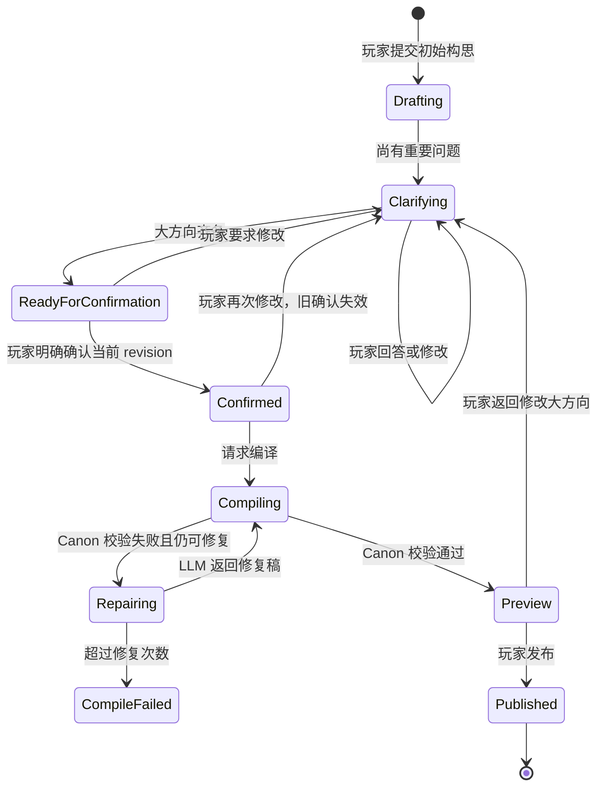

# 玩家故事创作工作台：页面开发上下文

> 基线日期：2026-08-02
>
> 文档状态：PC 单进程工作台已实现；设计会话、鉴权与配额仍是后续范围
>
> 当前已实现：无状态对话访谈、严格确认稿、StoryPlan 与分片 Canon 编译、SQLite 可恢复任务/草稿、
> PC 轮询与刷新恢复、脱敏质量预览及原子发布。
> 当前未实现：服务端设计会话历史、接口鉴权/配额、多实例 worker、持久化房间/checkpoint 与多 Session 战役。

## 一、产品目标

玩家不需要理解 Canon JSON，也不需要一次写出完整剧本。玩家只需描述一个故事构思，系统通过
数轮简短对话确认重要方向，形成设计摘要；玩家明确确认后，系统才把摘要编译为引擎可以运行的
Canon。

```text
玩家创意
  → 故事策划访谈
  → 玩家确认设计摘要
  → StoryPlan 与确定性图校验
  → 分片 Canon 编译、完整校验与定向修复
  → Pro 连贯性复核
  → 玩家查看公开预览
  → 发布剧本
  → 创建游戏
```

核心原则：

- 大方向由玩家决定，不确定时必须确认。
- 每轮最多询问 3 个重要问题，不把创作做成配置表。
- 技术字段和普通数值由系统补齐，不打扰玩家。
- 未确认设计稿不能生成 Canon。
- Canon 未通过引擎校验不能发布或开始游戏。
- 运行时 DM 不接收完整私有 Canon，只读取当前剧情拍的裁剪上下文。

## 二、已存在的代码契约

页面开发前应先阅读：

- `src/story/prompt.py`
  - `STORY_INTERVIEW_RULE`：多轮访谈规则。
  - `build_story_interview_prompt(...)`：拼接访谈历史和上一版设计稿。
  - `validate_confirmed_design_brief(...)`：确认稿的后端硬门槛。
  - `CANON_AUTHORING_RULE`：确认稿到 Canon JSON 的编译规则。
  - `build_canon_authoring_prompt(...)`：未确认时直接拒绝编译。
  - `build_canon_repair_prompt(...)`：Canon 校验失败后的有限修复任务。
- `src/model/canon.py`
  - `Canon.from_dict(...)`：JSON 反序列化。
  - `validate_canon(...)`：结构、引用、可达性、遭遇和特殊行动校验。
- `src/story/loader.py`
  - 已发布 Canon 的文件加载和注册。
- `canon/whispers_bell_tower.json`、`canon/prodigal_return_quest.json`
  - 当前两份互补的合法 Canon 结构参考，不是新故事必须复制的内容。
- `docs/故事框架/02-Canon生成Prompt与双参考同步规范.md`
  - 记录两份参考 Canon 的差异、完整生成 Prompt 契约和 JSON 变更同步顺序。

## 三、两个独立阶段

### 1. 故事策划访谈

访谈阶段不能生成 Canon、NPC 秘密或战斗数值，只维护玩家可以理解的 `design_brief`。

需要确认的大方向：

- 玩家角色的身份、动机及其与事件的关系。
- 核心冲突与主要对手方向。
- 调查、社交、探索、战斗、解谜的玩法优先级。
- 故事基调、恐怖程度及内容边界。
- 预计时长、玩家人数。
- 结局取向。
- 必须保留和绝不能出现的元素。

不需要逐项询问：

- NPC、地点、道具的具体名字。
- 普通敌人的精确 HP、AC、攻击和骰子。
- 技术 ID、随机种子和 JSON 字段。
- 不影响主要选择的装饰场景。

### 2. Canon 编译

只有满足以下条件才允许进入：

```text
design_brief.user_confirmed == true
design_brief.confirmed_revision == design_brief.revision
validate_confirmed_design_brief(design_brief) == []
```

编译阶段产生私有 Canon，包括尚未发现的线索、NPC 秘密、Boss 卡面和结局条件。该内容不能
直接展示在访谈页或普通剧本详情页。

## 四、设计会话状态机



前端主状态：

```ts
type StoryDesignStatus =
  | 'needs_clarification'
  | 'ready_for_confirmation'
  | 'confirmed'

type CompileStatus =
  | 'not_started'
  | 'queued'
  | 'compiling'
  | 'repairing'
  | 'ready'
  | 'failed'
  | 'published'
```

## 五、页面信息架构

建议 PC 端路由：

```text
/stories/new                       创建故事入口
/stories/design/:designId          对话式创作工作台
/stories/design/:designId/preview  剧本公开预览与发布
/campaigns/:campaignId             已发布剧本详情
```

如果实现微信小程序，可对应为：

```text
pages/story-create/index
pages/story-design/index
pages/story-preview/index
pages/campaign/index
```

页面不要把“访谈”和“运行游戏”混在同一时间线。创作工作台是剧本作者模式，冒险主屏是玩家模式。

## 六、页面一：创建故事入口

目标：降低第一次输入门槛，不要求用户写正式大纲。

推荐布局：

```text
┌────────────────────────────────────────┐
│ 创建你的冒险                            │
│ 不需要写完整剧本，先告诉我你想玩什么。    │
│                                        │
│ ┌────────────────────────────────────┐ │
│ │ 我想玩一场发生在幽灵船上的悬疑冒险… │ │
│ └────────────────────────────────────┘ │
│                                        │
│ 灵感示例：                              │
│ [失踪商队] [闹鬼庄园] [宫廷阴谋] [自定义]│
│                                        │
│                          [开始共同创作] │
└────────────────────────────────────────┘
```

交互要求：

- 输入只需要一个构思，建议 `20～2000` 字。
- 灵感卡片只能填充输入框，不能绕过访谈直接生成。
- 提交后创建 `design_id` 并跳转创作工作台。
- 模型调用期间显示“正在理解你的构思”，禁止重复提交。
- 模型不可用或输出无法解析时显式报错，保留用户原文供重试。

## 七、页面二：对话式创作工作台

### 推荐桌面布局

```text
┌──────────────────────────────────────────────────────────┐
│ 返回  故事工作台                         已确认 4/7 项      │
├──────────────────────────────────┬───────────────────────┤
│ 故事策划对话                      │ 当前设计摘要           │
│                                  │                       │
│ 你：我想玩幽灵船悬疑故事。         │ 暂定标题：雾海亡航      │
│                                  │ 玩家身份：待确认        │
│ 策划：我理解为……                  │ 核心冲突：调查失踪船员  │
│ 先确认三个会改变体验的问题：       │ 玩法：调查 > 探索       │
│                                  │ 基调：阴郁悬疑          │
│ 1. 玩家是什么身份？               │ 时长：20 分钟           │
│ [受雇调查员] [幸存船员] [海军]     │ 结局：待确认             │
│                                  │                       │
│ 2. 更偏调查还是战斗？             │ 未确认项                │
│ [调查为主] [均衡] [战斗为主]       │ · 玩家身份              │
│                                  │ · 主要对手方向          │
│ 3. 恐怖程度？                     │ · 结局取向              │
│ [轻度] [压迫] [克制不猎奇]         │                       │
│                                  │                       │
│ [自由回答…………………………] [发送]   │                       │
└──────────────────────────────────┴───────────────────────┘
```

移动端把右侧摘要折叠为顶部“设计摘要 4/7”抽屉，底部保留输入框。

### 问题卡片

每轮 `questions` 为 1～3 项。每项展示：

- `question`
- 可选的 `why_it_matters`
- `suggested_options`
- 自由文本入口

选项只是快捷回答，不是封闭答案。用户可以：

- 逐题点选后一次提交。
- 直接自由回答全部问题。
- 回复“这部分你决定”。
- 修改之前已经确认的内容。

前端不应自行推导答案，所有更新后的 `design_brief` 由后端返回。

### 摘要面板

公开展示：

- 暂定标题。
- 一句话前提。
- 玩家身份与动机。
- 核心冲突。
- 对手方向；若为秘密，仅显示“由系统设计并在游戏中揭晓”。
- 玩法侧重。
- 基调和内容边界。
- 时长、人数和结局取向。
- 必备与禁止元素。
- 系统获得自由设计权的事项。

不要展示：

- 最终反派真实身份。
- NPC 秘密。
- 未发现线索。
- Boss 数值与特殊行动。
- Canon JSON、内部 ID、prompt 或校验日志。

## 八、确认交互

当后端返回 `ready_for_confirmation`：

- 隐藏普通问题卡，显示完整设计摘要。
- 主按钮为“确认并生成剧本”。
- 次按钮为“我想修改”。
- 按钮文案不能写成“下一步”，需要明确这是创作方向确认。

确认请求必须携带当前 `revision`：

```json
{
  "revision": 4
}
```

后端只允许确认服务器当前版本。若页面版本已过期，返回 `409 revision_conflict`，前端刷新摘要并提示：

> 故事设计已发生变化，请检查最新摘要后重新确认。

任何方向性修改都必须：

```text
revision += 1
confirmed_revision = null
user_confirmed = false
compile_status = not_started
```

旧确认、旧 Canon 草稿和旧预览不得继续发布。

## 九、编译与校验页面状态

确认后可以自动发起编译，也可以让用户再点一次“开始生成”。推荐自动编译，减少一步操作。

进度只展示真实阶段：

```text
正在整理人物与地点
→ 正在生成剧情结构
→ 正在检查引用与结局
→ 正在修复结构问题（如发生）
→ 剧本已准备好
```

这套文案不要求后端暴露模型思考，只映射真实任务状态。

错误处理：

| 错误 | 页面行为 |
| --- | --- |
| 模型配置缺失/调用失败 | 显示“生成服务暂不可用”，允许重试，不生成假剧本 |
| LLM JSON 无法解析 | 显示生成失败，保留确认稿，允许重试 |
| Canon 校验失败且可修复 | 显示 `repairing`，后端有限次数修复 |
| 超过修复次数 | 显示结构错误摘要，允许返回访谈或重新编译 |
| revision 冲突 | 拉取最新版，要求重新确认 |
| campaign_id 冲突 | 后端生成新 ID 或要求修改公开标题，不覆盖已有剧本 |

## 十、页面三：公开预览与发布

Canon 校验通过后，只展示从私有 Canon 投影出的公开信息：

```text
剧本封面/占位图
标题
一句话前提
基调与内容提示
预计时长、推荐人数
玩法标签
玩家在故事中的身份
无剧透的开场钩子
```

操作：

- “发布并开始游戏”
- “发布到我的剧本”
- “返回修改设计”

返回修改会使当前确认和 Canon 草稿失效。页面必须二次提示：

> 修改故事方向后需要重新确认并生成，当前预览将被替换。

## 十一、前端数据结构建议

```ts
type StoryQuestion = {
  id: string
  question: string
  why_it_matters: string
  suggested_options: string[]
  allow_free_text: boolean
}

type StoryDesignBrief = {
  revision: number
  confirmed_revision: number | null
  working_title: string | null
  premise: string | null
  player_role: string | null
  core_conflict: string | null
  antagonist_direction: string | null
  gameplay_focus: string[]
  tone: string | null
  content_boundaries: string[]
  duration_minutes: number | null
  player_count: number | null
  ending_direction: string | null
  must_have: string[]
  must_avoid: string[]
  system_design_freedom: string[]
  user_confirmed: boolean
}

type StoryDesignMessage = {
  id: string
  role: 'user' | 'assistant'
  content: string
  created_at: string
}

type StoryDesignView = {
  design_id: string
  status:
    | 'needs_clarification'
    | 'ready_for_confirmation'
    | 'confirmed'
  compile_status:
    | 'not_started'
    | 'queued'
    | 'compiling'
    | 'repairing'
    | 'ready'
    | 'failed'
    | 'published'
  messages: StoryDesignMessage[]
  design_brief: StoryDesignBrief
  questions: StoryQuestion[]
  public_preview?: CampaignPreview
  error?: {
    code: string
    message: string
    retryable: boolean
  }
}
```

## 十二、后端接口建议

### 当前单进程 API

```text
POST   /api/stories/interview
POST   /api/stories/generation-tasks          -> 202
GET    /api/stories/generation-tasks/{task_id}
DELETE /api/stories/generation-tasks/{task_id}
POST   /api/stories/drafts                     兼容同步包装
POST   /api/stories/drafts/{draft_id}/publish
```

任务响应只包含状态、阶段、进度、脱敏错误和完成后的公开草稿；不会返回 StoryPlan、完整 Canon、
NPC 秘密或谜底。SQLite 默认位于 `.data/story_generation.sqlite3`，可用
`STORY_GENERATION_DB_PATH` 覆盖。下面的 `story-designs` 资源模型仍是未来引入服务端设计会话后的建议。

### 创建访谈

```http
POST /api/story-designs
```

```json
{
  "content": "我想玩一场发生在幽灵船上的悬疑冒险。"
}
```

返回 `StoryDesignView`。

### 继续访谈

```http
POST /api/story-designs/{design_id}/messages
```

```json
{
  "content": "玩家是唯一幸存的领航员，调查为主，恐怖程度克制一些。"
}
```

同一个 `design_id` 的 LLM 调用必须串行，避免两个回答同时覆盖设计稿。

### 确认设计

```http
POST /api/story-designs/{design_id}/confirm
```

```json
{
  "revision": 4
}
```

后端重新执行 `validate_confirmed_design_brief`，不能信任前端传入的 `user_confirmed`。

### 编译 Canon

```http
POST /api/story-designs/{design_id}/compile
```

要求：

- 当前状态已经确认。
- 确认版本与当前版本一致。
- 同一版本重复请求应幂等，不创建多个任务。
- 编译、JSON 解析、`Canon.from_dict`、`validate_canon` 和有限修复都在服务端完成。

### 查询状态

```http
GET /api/story-designs/{design_id}
```

用于刷新、断线恢复和编译轮询。也可以通过 WebSocket 推送 `story_design_updated`。

### 发布

```http
POST /api/story-designs/{design_id}/publish
```

只允许发布校验通过且与当前确认版本一致的 Canon。

## 十三、建议的错误码

| HTTP | code | 含义 |
| --- | --- | --- |
| 404 | `design_not_found` | 设计会话不存在或不属于当前用户 |
| 409 | `revision_conflict` | 页面提交的版本不是服务器当前版本 |
| 409 | `design_not_confirmed` | 尚未确认，禁止编译 |
| 409 | `compile_in_progress` | 当前版本正在编译 |
| 409 | `draft_stale` | Canon 草稿不属于当前设计版本 |
| 422 | `design_incomplete` | 仍缺少必须由玩家确认的大方向 |
| 422 | `canon_validation_failed` | Canon 修复后仍未通过结构校验 |
| 503 | `story_model_unavailable` | 真实 LLM 不可用 |

错误正文只返回玩家可理解的信息，不返回 system prompt、私有 Canon 或完整模型原始输出。

## 十四、持久化模型建议

### story_designs

```text
design_id
owner_user_id
status
compile_status
revision
confirmed_revision
design_brief_json
public_preview_json
compiled_campaign_id
created_at
updated_at
```

### story_design_messages

```text
message_id
design_id
role
content
created_at
```

### canon_drafts

```text
draft_id
design_id
design_revision
status
canon_json                 私有
validation_errors_json     私有调试信息
repair_attempts
created_at
updated_at
```

生产环境不建议直接把用户生成 Canon 写进代码仓库。应存数据库或对象存储，发布后由可持久化
CanonRegistry 按 `campaign_id` 加载。当前文件注册表只适合内置剧本和开发阶段。

## 十五、对话示例

第一轮：

```text
玩家：
我想玩一场幽灵船悬疑故事。

故事策划：
我理解为一场被困海上的短篇悬疑冒险。先确认三个会明显改变体验的问题：
1. 玩家是受雇调查员、遇难幸存者，还是幽灵船原船员的后代？
2. 你希望调查、社交和战斗哪一个最重要？
3. 你想要轻度灵异，还是更压迫的恐怖氛围？
```

第二轮：

```text
玩家：
唯一幸存的领航员，调查为主，恐怖克制一点。幕后真相你来设计。

故事策划：
已确定玩家身份、玩法和基调，并记录“幕后真相由系统设计”。还需要确认：
1. 希望控制在 20 分钟还是 40 分钟？
2. 结局偏英雄胜利、苦涩代价，还是由关键选择决定？
3. 有没有绝对不希望出现的内容？
```

最终确认：

```text
故事策划：
最终设计摘要：
- 玩家：幽灵船事故的唯一幸存领航员，为洗清责任重返雾海。
- 玩法：调查 > 探索 > 战斗。
- 基调：克制的海上灵异，不使用猎奇肢体恐怖。
- 时长：20 分钟，单人。
- 结局：关键选择决定救赎或付出代价。
- 幕后真相：由系统设计，在游戏中揭晓。

确认按这个方向生成剧本吗？
```

只有玩家明确回答确认后，才能生成 Canon。

## 十六、隐私与安全边界

- 玩家输入属于不可信数据，不能覆盖故事策划或 Canon 编译器 system prompt。
- 普通页面和 API 不得返回 NPC 秘密、未发现线索、隐藏结局、Boss 卡面和完整 Canon。
- `reference_canons` 只在服务端编译时使用，并在每次编译前重新读取两份内置 Canon。
- 不记录或展示模型思考过程。
- 真实 LLM 失败时显式失败，不生成模板 Canon 或离线假剧本。
- 发布前检查内容长度、用户权限、标题和 ID 冲突。

## 十七、页面验收标准

1. 玩家第一次提交构思后不会直接得到可运行剧本。
2. 每轮最多展示 3 个关键问题。
3. 玩家已经回答的方向不会被重复询问。
4. 用户可以自由回答，不被快捷选项限制。
5. 大方向齐备后必须先展示最终摘要。
6. 未确认状态下，前端和后端都不能调用 Canon 编译。
7. 页面使用旧 revision 确认时收到冲突并刷新。
8. 确认后修改任意方向性字段会使旧确认和旧草稿失效。
9. 编译和修复过程中刷新页面可以恢复真实状态。
10. 模型失败、JSON 解析失败和 Canon 校验失败都有明确且可重试的错误。
11. 预览页不泄露私有 Canon 内容。
12. 只有当前确认版本生成且校验通过的 Canon 可以发布和开始游戏。

## 十八、推荐开发顺序

### 阶段一：页面原型

- 使用本地 mock 的 `StoryDesignView` 完成创建页、访谈页、摘要面板、确认态和编译进度态。
- 不模拟 LLM 内容，只模拟接口 DTO。

### 阶段二：访谈后端

- 实现设计会话持久化。
- 接入真实 LLM 和 `STORY_INTERVIEW_RULE`。
- 实现结构化 JSON 解析、revision 和确认接口。

### 阶段三：Canon 编译

- 接入 `build_canon_authoring_prompt`。
- 实现 `Canon.from_dict + validate_canon + 有限修复`。
- 生成无剧透公开预览。

### 阶段四：发布与开局

- 实现持久化 CanonRegistry。
- 把发布剧本接到创建房间和剧本详情页。
- 增加权限、配额、内容审核和资源生成。

## 十九、后续开发会话最小上下文

继续页面开发时，至少提供以下文件：

```text
docs/故事框架/创建故事.md
docs/故事框架/01-玩家大纲到可运行Canon.md
src/story/prompt.py
src/model/canon.py
front/pc-dnd-bot/src/types/game.ts
front/pc-dnd-bot/src/components/GameScreen.tsx
```

页面实现应以本文的数据契约与状态机为准；如果接口字段发生变化，需要同步更新本文、后端
Pydantic schema、前端 TypeScript 类型和相关协议测试。
