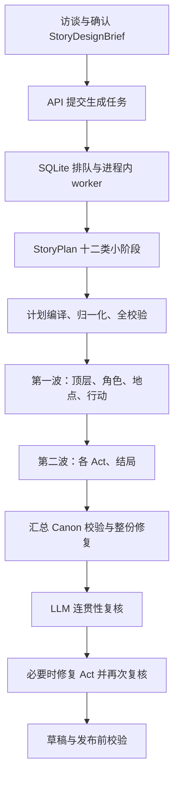

# 故事生成稳定性与速度优化方案

> 评审日期：2026-09-09。状态：方案，尚未修改生成代码。
> 基于当前工作区代码，包括已有未提交改动；真实模型延迟和成功率尚未进行基准测试。

建议把生成流程收敛为：**紧凑的全局计划 → 确定性编译机械结构 → 按章节填充内容 → 同一版本的校验与复核 → 可恢复草稿**。优先消除必然失败的契约，再减少模型调用次数和重复上下文。

## 1. “真实可用”的验收标准

可用剧本需要同时满足四个条件：

1. **能够生成完成**：合法设计稿有可行的生成路径，正常调用数不会超过任务预算；失败能够定位到具体阶段。
2. **引擎能够执行**：引用闭合，触发条件具备正确参数，卡面和行动属于现有规则协议；状态变化由引擎执行。
3. **玩家能够推进**：关键道具在需要前可获得，分支没有合流后的必然死锁，失败和关键 NPC 死亡有实际可执行的后续；胜负不会被无关遭遇触发。
4. **剧情能够成立**：NPC 动机、线索答案、选择后果和结局回应一致；这些仍由真实 LLM 创作和复核。

JSON 可解析、ID 存在和图可达分别只是其中一部分。自动校验也不能证明任意自然语言剧情一定好玩，需要保留真实试玩抽检。

## 2. 当前主流程



主要入口是 `StoryService._run_task()` 调用 `generate_staged_canon()`。公开的旧 `/drafts` 接口也经 `create_draft_via_task()` 进入同一管线。`generate_canon()` 和 `_generate_story_plan()` 仍有旧代码及测试调用，但不是当前公开任务的主生成路径。

现有 SQLite artifact、全局信号量、分片 TaskGroup、计划归一化、规则校验和模型职责映射都值得复用。无需另建任务框架。

## 3. 已确认的问题与证据

### 3.1 P0：正常调用数量与默认预算冲突

`src/services/story_service.py:63` 默认 `STORY_TASK_CALL_LIMIT=24`，当前环境加载后的值也为 24；`src/story/generator.py:829` 的渐进规划已明显超过旧预算的设计规模。

按代码循环推导，令：

- A：Act 数；P：可玩 Beat 数；C：线索数。
- E：七类实体各自按 5 项分批的调用数之和。
- F、I、Q：flag、item、payoff 数量。

不含任何错误、修复、重试及访谈时：

```text
规划调用数 = 4 + A + 2×ceil(P/3) + E + P + ceil(C/3)
           + ceil(Q/3) + ceil((F+I)/3)
完整调用数 = 规划调用数 + A + 6
```

固定的 4 次是框架、分支蓝图、实体数量、双结局；后续 A+6 次是四种基础分片、A 个 Act、结局分片和连贯性复核。空分支和空 actions 当前仍会调用模型。

| 档位 | 使用该档位最小规模时的规划下界 | 完整流程调用下界 |
| --- | ---: | ---: |
| short | 16 | 24 |
| standard | 22 | 31 |
| long | 31 | 41 |

这些是非常乐观的下界：只有 1 个 actor，flags/items/actions/payoffs 全为零，模型每次都成功；它们不代表这样的内容组合一定能通过所有校验。短篇下界也没有留下任何恢复余量。

另用仓库 `_standard_plan()` 和 `_progressive_responder()` 跑真实规划编排、仅替换 LLM 返回值，得到：**规划 26 次、修复 0 次，完整流程需 35 次**。加上 24 次限制后，规划尚未完成就终止。不能依靠单纯换快模型解决这个问题。

### 3.2 P0：默认短篇要求本身无解

`src/schemas/story.py:140` 默认短篇为 3 个可玩 Beat，默认 pacing 为 10/45/20/20/5。渐进规划固定首拍 opening、末拍 climax，中间只能是 exploration 或 conflict。

`src/story/validation.py:331` 却把 Beat.kind 当作唯一的玩法时间分类，要求每类与 pacing 目标偏差不超过 15 个百分点：

- 中间为 exploration：escalation 占比为 0%，与默认 20% 冲突。
- 中间为 conflict：exploration_social 占比为 0%，与默认 45% 冲突。

已确认这种设计稿可以通过 `StoryService._validated_brief()`；上述两条校验错误也已离线复现。改变每拍分钟数无法补出缺失的类别。

还有同类晚发现问题：每 Act 最多 3 个可玩 Beat 是规划阶段才检查的约束；效果 owner 校验主要检查 ID 类别，却允许 item 选择最终物品来源统计不支持的 owner，例如 encounter_win。应在模型生成前或最早契约边界拒绝无解组合。

### 3.3 P0：分片结构错误可能直接跳过修复

`_generate_fragment()` 没有先通过分片 Pydantic schema；`_fragment_errors()` 先调用 `validate_fragment_ids()`，后者多处直接对模型返回的数组元素调用 `.get()`。

已复现：

```text
cast = [42]          → AttributeError
locations = [null]   → AttributeError
```

这些都是能够解析的 JSON，但会使任务直接失败，无法进入正常的分片校验修复循环。JSON mode 本身没有替代业务结构校验。

修复方向是先验证边界结构，再做引用和规则校验。不要在每个 `.get()` 周围分别添加异常兜底。

### 3.4 P0：汇总修复绕开计划约束

`src/story/generator.py:2390` 的 `_repair_assembled_canon()` 会把整份 Canon 交给模型重写，返回后只做 Canon、规模和 owner 校验，没有重新逐片核对计划锁定的 ID、出口拓扑、Beat 归属与时长等全部约束。

这意味着部分结构漂移可能通过末端校验。该阶段的修复次数也没有加入 `total_repairs`；`assembled_canon` 落库时 attempt 固定为 0，公开质量指标会低估实际修复量。

### 3.5 P0：恢复边界没有保证复核与正文同版本

`src/story/generator.py:672` 每次都从分片重新组装；虽然保存了 `assembled_canon`，恢复时并未使用该快照。

同时，`continuity_review` 和 `continuity_review_final` 直接按 artifact key 复用，没有关联 Canon 内容指纹。若前一次汇总修复改变了正文，重启后重新组装、再次修复可能得到另一份内容，却沿用旧复核结果。

另外两次复核都是先调用 `on_artifact()`，再执行 `_validate_continuity_review()`。结构非法的复核候选可能先被存成 validated artifact，恢复后继续失败。

Act 连贯性修复逐片落库、最后才写 repair marker，也存在中途重启得到部分替换结果的窗口。需要统一处理快照、验证顺序和原子提交。

### 3.6 P1：调用拆得过细，上下文却没有随之缩小

`src/story/prompt.py:678` 序列化全部已验证规划状态；每个小阶段重新携带完整状态、确认稿、全局规则和 schema。

仓库标准样例的离线测量：

- 26 次规划请求累计 **160,245 个 prompt 字符**，单次约 3,959–8,326 字符。
- 基础分片 prompt 即使是 top_level，也约 **26,624 字符**；其他分片同样约 2.6 万字符。
- 这是字符串长度测量，不能当成供应商 token 用量或真实延迟。

分片 prompt 还重复携带完整计划、ID registry、owner ledger 和全部功能参考。另一方面，后生成的 Act 并未得到实际已编译角色、地点和行动的相关内容，只拿计划摘要；编译结果主要用于代码校验。这会让模型重复推测细节，增加跨分片矛盾的风险。

### 3.7 P1：规划承诺未被完整落实为可执行内容

计划包含 `fail_forward`、线索接近方式、分支后果和结局所需事实。但目前主要检查数量、ID 和文字字段是否存在，尚未建立完整的“前置条件—获取途径—触发效果—后续消费”验证。

例如：选择 B 路线后，合流处却必须持有只在 A 路线发放的钥匙。出口图可达、所有 ID 合法，仍可能无法推进。

运行时真正消费的是 `stuck_fallback`、KeyInfo、Trigger、ActionDefinition、`payoff_flag_ids` 等字段。计划中的承诺需要编译到这些实际入口并检查；不能仅靠最后一次 LLM 给出 passed=true。

### 3.8 P1：失败收尾、重试和观测仍不完整

- 出口文案使用 `asyncio.gather()`；单个调用失败不会自动收掉其余已启动调用。应复用其他分片已有的 TaskGroup 模式，收尾完成后再进入任务终态。
- SDK 已设置 `max_retries=0`，应保留。应用层仍有传输、JSON、业务修复多层调用；单个规划小阶段最坏可产生 8 次真实请求，受任务总预算进一步限制。
- 429、超时等瞬时错误立即重试，缺少退避；全部阶段共用 120 秒超时，没有阶段输出大小控制和完成原因分析。
- 20 分钟 timeout 在每次 `_run_task()` 执行时重新开始，不是跨重启保持的绝对截止时间。
- 当前主要记录调用开始与累计次数，缺少请求完成耗时、信号量等待、输入输出 token、finish reason 和错误分类。
- 进度直接赋值，连贯性修复后再次复核可从 92% 回到 90%；规划占 10–24%，也不能反映其真实耗时。

SQLite store 明确针对单进程 worker。当前方案继续采用该部署边界；只有需要多进程/多实例生成时，再补领取租约与恢复隔离，不能直接把 API worker 数调大当作扩容方案。

## 4. 建议的生成流程

### 4.1 前置契约检查

提交任务前统一校验规模、分支容量、Act/Beat 容量、默认节奏可行性、支持的 owner/效果组合和正常调用预算。

短期修正三拍短篇的默认节奏，并同步访谈示例和 schema 默认值。已经由玩家明确确认的节奏不静默更改；无法实现时在访谈/提交边界指出冲突。

后续把“玩法时长”与 Beat 的剧情功能区分：一个 exploration 拍也可以包含社交和战斗。由 Beat.kind 推导出的百分比适合作为估算提示，不能继续作为精确玩法比例的替代物。玩家明确指定的玩法约束仍须兑现。

预算由实际计划的正常调用数加固定恢复余量推导，并受现有配置硬上限约束。超过配置时提前明确失败；生成出实体数量后再核对后续预算。迁移期间也要同步调整旧默认预算，不能让新拆分流程沿用不匹配的 24 次限制。

### 4.2 两次紧凑规划

第一次生成故事核心：冲突真相、角色动机、章节作用、Beat 目标与分支意图。第二次补齐跨章节因果契约：实体引用、线索所在位置、道具/flag 来源、出口条件、分支后果与结局条件。

两次规划只输出紧凑结构，不提前写完整卡面、场景描写和长段正文。长篇确实超过输出预算时，按完整的因果单元拆批。

代码分配内部 ID、派生冗余字段、编译既有分支结构，并在填充正文前验收完整计划。剧情内容、分支含义和关键机械效果的语义仍由 LLM 决定；代码不得猜测剧情来“修好”结果。

当前 `PlanExit.condition_summary` 只有自然语言，尚不足以直接编译 Trigger。因此需收敛内部计划 schema，明确保存触发器种类、参数及效果来源；不能靠关键词规则从描述中猜出条件。优先改变内部生成契约，最终 Canon 继续使用现有引擎协议，旧任务按生成版本处理兼容与失效。

将以下零散调用合并进所属计划：Beat 大纲与细节、实体数量与清单、出口文案与条件、线索与其 owner、伏笔与回收。

**一次模型调用可以包含多个对象，每个对象仍可独立校验和修复。** 将旧 08 方案的“每个对象都继续拆调用”调整为“按输出预算分批、按错误对象修复”。空分支、空行动等已确定空集直接由代码生成。

### 4.3 代码骨架与内容填充

| 内容 | 负责方与生成方式 |
| --- | --- |
| campaign/Beat/Trigger ID、顺序、数量、已确认元数据 | 代码产生或从计划复制 |
| 引用、出口目标、效果 owner | 在已验证计划中锁定；代码装配 |
| 触发器参数、具体行动效果 | LLM 在规划契约中明确，代码按已支持协议编译与校验 |
| NPC 内容和静态卡面、地点内容 | 按类别批量生成；输出过大时再分批 |
| 章节内容 | 每 Act 一次；只在该 Act 过大时拆 Beat |
| 行动定义 | 已有计划非空时生成，必要时按输出大小分批 |
| 结局与公开简介 | 小型联合载荷；胜负条件来自计划 |

角色和地点可并行；Act 接收其涉及的真实角色、地点和行动资料后并行。使用现有全局信号量和 TaskGroup，先保留当前 3 个全局模型并发上限，用数据评估是否调整。

每个 prompt 只包含全局事实摘要、当前章节契约、相关实体与效果、必要的相邻章节因果，以及对应类型的短参考。不能把其他章节的完整正文和无关战斗样例反复发送。

普通规模预期调用构成为：2 次规划 + 2 类基础资源 + 0–1 次行动 + A 次章节 + 1 次结局/简介 + 1 次复核，即 **A+6 到 A+7 次**。这是设计目标；长篇资源分批会增加次数，必须计入预算后再执行。

### 4.4 对象级修复与统一验证

验证顺序固定为：

```text
JSON 对象 → 分片 schema → 编译锁定字段 → 引用与规则检查
→ 计划一致性检查 → 完整 Canon 检查 → 玩法路径检查
```

复用 `CanonNpcDraft`、`CanonLocationDraft`、`CanonBeatDraft` 等现有类型，补最少的分片外壳和缺失的跨字段校验。Trigger 还需按 kind 检查必填参数，不能仅验证它是一个 dict。

错误使用 code、对象 ID、字段路径定位。返回完整的受影响对象，按 ID 白名单替换；不实现通用任意 JSON patch。跨对象问题扩展到实际依赖闭包，ID、拓扑和 owner 不允许随正文修复改变。

取消整份 Canon 的模型重写。合并后重新执行相同校验；错误指纹未改善就停止，所有请求和修复都计入同一个任务预算。可唯一推导的机械错误由代码修复，语义错误仍交给真实模型。

### 4.5 可玩性检查与一次语义复核

利用当前最多 12 个可玩 Beat 的规模，对支持的确定性条件做路径检查：

- 条件所需 flag/item 是否在当前路径此前有合法来源，不能把互斥路线得到的物品合并成“全队拥有”。
- 一次性物品消费、行动前置条件是否导致后续必然无法满足。
- 本拍允许地点是否能从入场地点走到，线索与敌人是否处于实际可进入的地点。
- 每条必经硬门槛的失败后续、替代途径，是否存在于实际 Trigger/ActionDefinition/KeyInfo 中。
- 全局胜负、普通遭遇与高潮遭遇之间的绑定是否符合计划。

任意自然语言和 semantic 条件不能由静态分析证明，标为待语义检查；不得假设成立并伪装成验证通过。

最终由真实 LLM 做一次因果/动机/线索/分支/结局复核。报告绑定具体对象与证据；可复现的矛盾为 error，审美建议为 warning。修复范围支持 NPC、地点、行动、Beat 和结局，不能只允许 Act，否则无法修正真正位于角色或结局里的问题。

先校验报告 schema，再落库。有实质修改时才再次复核。

### 4.6 恢复、取消与调用治理

- 保留 SQLite；给有效产物附带生成版本和依赖指纹。复核报告明确绑定经过验证的 Canon 内容 hash。
- `assembled_canon` 成为真正可复用的已验证快照；正文改变时，使依赖它的复核失效。
- 多对象修复全部通过检查后，在同一事务提交替换结果与修复标记；不暴露一半新、一半旧的有效快照。
- 提供针对可恢复失败的继续入口，复用兼容的成功产物；只重试未完成对象。重试保留累计消耗并受有限的追加预算约束，不自动无限重跑。
- 保存跨重启的截止时间；显式继续是一次有记录的有限重试，不能通过重启悄悄刷新任务时间。
- 传输层只重试可恢复错误，遵守 Retry-After 或短退避；配置错误直接失败。JSON/结构错误使用同阶段修复预算。
- 保持 SDK 重试关闭；输出截断要根据 finish reason 和阶段大小调整分批，避免机械地重复整份输出。
- 取消或失败后先停止并等待子任务收尾，终态任务不再接受迟到的产物/进度写入。
- 保留当前轮询和浏览器任务恢复机制，显示正在执行的实际阶段；进度按已完成工作量单调推进。

## 5. 实施顺序与验收

| 阶段 | 交付范围 | 必须验证 |
| --- | --- | --- |
| 第一阶段：消除确定性失败 | 默认契约与预算；分片 schema 先行；计划一致性；复核先验证；快照与复核绑定；并发收尾 | 默认短篇可行；合法完整任务不被正常预算杀死；坏数组元素进入结构修复；漂移的 ID/出口被拒绝；恢复不复用错误正文的复核 |
| 第二阶段：减少调用与输入 | 两次紧凑规划；内容按 Act/类别成批；空集免调用；上下文按依赖裁剪；对象级修复 | 完整调用数量、累计输入量和真实耗时下降；完整校验及已确认内容约束继续通过 |
| 第三阶段：验证可玩性与体验 | 确定性路径检查；真实模型试玩抽检；继续生成入口；单调进度 | 互斥分支钥匙、NPC 死亡、检定失败、战斗失败、道具消费等场景无已知死锁；失败可定位和恢复 |

轻量调用观测应从第一阶段就加：task/stage/object/attempt、模型职责、等待耗时、请求耗时、输入输出大小、供应商 token（如可得）、完成原因、修复类别。沿用日志和现有存储，不先建监控平台。

主要改动集中在 `generator.py`、`prompt.py`、`validation.py`、`schemas/story.py`；恢复一致性涉及 `store.py` 与 `story_service.py`。只在当前 wire format 确实无法承载必要玩法信息时，才协调扩展 `model/canon.py` 和运行时消费。新流程稳定后清理不再使用的旧生成路径。

## 6. 验证证据与量化目标

本次执行：

```powershell
$env:STORY_GENERATION_DB_PATH = '.data/story-review-tests.sqlite3'
& '.venv/Scripts/python.exe' -m unittest test.test_story_api test.test_story_generation_pipeline test.test_story_plan_convergence test.test_story_plan_progressive test.test_story_continuity test.test_canon_authoring_prompt
```

结果：**94 项测试通过，测试运行时间 4.585 秒**。使用隔离数据库；没有调用真实模型。这个时间是离线测试耗时，不能作为剧本生成速度。

额外离线核算/复现：标准样例 26 次规划调用、24 次预算提前中止、短篇两种中间 Beat 均触发缺失节奏类别、非法分片元素抛 AttributeError。

现有测试多验证单阶段，部分编排测试替换了完整校验或从已有 plan 开始，因此通过测试没有覆盖上述完整生成问题。改造时增加少量集成回归，**只替换 LLM 边界，保留真实编排、校验、预算和持久化**。

以下是建议的验收目标，尚不是已测得的效果：

| 指标 | 目标 |
| --- | --- |
| 默认 short/standard/long 契约与预算 | 全部存在可行的正常生成路径 |
| 标准篇无修复生成调用数 | 不超过 12 次；包括最终复核，不含访谈 |
| 同等标准篇累计 prompt 字符 | 相比当前完整管线基线减少至少 50% |
| 标准篇真实端到端耗时 | 在相同模型、输入与并发负载下，P50/P95 均减少至少 40% |
| 无人为取消任务的最终有效草稿率 | 初步目标至少 95%，同时报告样本量与故障分类 |
| 已验证产物恢复 | 输入和版本未变化时，不重复生成 |
| 已知机械死锁与引用错误 | 回归用例必须全部阻止发布 |

真实基准先对三档各取 10 份固定设计稿进行配对试跑，用于发现问题；稳定后扩大样本，不能用 30 次试跑宣称高置信度稳定性。统一记录完整成功率、首次通过率、修复率、总调用数、token 与 P50/P95，并区分排队时间和模型耗时。至少抽检线性、分支、硬门槛、NPC 死亡、失败推进和战斗结局的实际运行。

本期沿用现有 Python、Pydantic、asyncio、SQLite 与模型注册表。完整草稿验收后才供玩家开始游戏；章节生成到一半就开局会扩大运行时一致性问题，不作为本轮提速手段。

## 7. 实施结果（2026-09-09）

以上第 1—6 节保留改造前审计和目标，本节记录实际完成情况。

### 7.1 已落地的流程

```text
确认稿可行性检查
→ 故事核心与章节分配（1 次模型调用）
→ 紧凑完整计划（1 次模型调用，失败时有限修复）
→ 角色 / 地点 / 顶层 / 行动分片
→ 按 Act 编写章节与结局
→ 完整结构、计划一致性、资源路径检查
→ 真实模型连续性复核
→ 保存可发布草稿
```

- 空行动集直接编译为 `[]`，其余正文仍由真实模型生成。两个分片阶段各限制并发，章节接收已生成的角色、地点和行动事实。
- 代码派生 ID、出口、已锁定条件、时长及元数据，修复只能替换白名单中的完整对象。修复后重新执行完整检查，连续性修复最多一次，再进行最终复核。
- 分片先通过 Pydantic 再读取字段；公共请求处理 JSON 模式、截断、瞬时失败和调用计数。对象修复返回层级不合约时只允许一次结构纠正。
- 短篇默认节奏改为可实现的 `10/65/0/20/5`；确认稿校验分支数量、章节容量和节奏可行性，生成前检查剩余调用预算。
- 快照绑定计划和分片内容，复核绑定实际正文 hash；只有校验通过的快照和报告才入库。发布再次读取、验收草稿。
- SQLite 保存截止时间；重启继续使用原截止时间。失败任务可由原请求方显式续跑一次，复用已完成产物，默认累计调用上限由 24 增至 48，消耗不会清零。已完成最终复核但仍有实质错误的任务不能继续。
- PC 端增加“继续生成（保留已完成内容）”，API 增加 retry 入口和 `can_retry`。进度单调递增，取消/失败时取消并等待并发子任务，终态拒绝迟到写入。

DeepSeek V4 的请求参数已通过真实 SDK 的 HTTP 边界测试：输出上限使用原生 `max_tokens`；正文编写及紧凑计划关闭思考，故事核心与连续性复核保留 low 思考。参数绑定到底层模型，避免 `include_raw` 包装层丢弃调用参数；SDK 截断异常保留真实正文后进入一次恢复。这些供应商参数依据 [DeepSeek 思考模式文档](https://api-docs.deepseek.com/guides/thinking_mode/) 和 [Chat Completion 接口文档](https://api-docs.deepseek.com/api/create-chat-completion/)。没有修改用户的模型注册配置。

### 7.2 已验证的结果

| 项目 | 实测结果及口径 |
| --- | --- |
| 完整离线回归 | 186 项通过，15.991 秒；隔离 SQLite，只替换模型边界；排除交互和真实模型流程脚本 |
| PC 构建与 lint | `npm run build`、`npm run lint` 均通过 |
| 标准篇无修复调用 | 同一固定样例，旧流程 35 次（其中规划 26 次），新流程 10 次（其中规划 2 次），包含最终复核、不含访谈 |
| 累计提示字符 | 同一样例旧流程 386,995，新流程 142,332，减少约 63.22% |
| 完整快照恢复 | 输入及内容未改变时，恢复与发布验收不重复调用模型 |
| 故障回归 | 非法分片元素、对象 ID 漂移、重复 flag 写入、互斥路线资源混用、消耗物品死锁、复核失效、修复后中断、并发取消收尾、截止时间与有限续跑均有覆盖 |

调用与字符对比使用仓库 `HEAD` 的旧提示构建器、旧渐进规划入口和固定模型应答，与新流程在相同样例及共享 schema 下比较。这是可重复的编排与输入规模测量，**不是真实生成耗时对比**。新流程集成回归在 `test/test_story_reliability.py`，保留真实生成编排、schema、规则验证、预算和持久化。

真实模型调试使用独立数据库和草稿目录，未发布故事。已经实际执行核心规划、计划修复、全部分片、汇总修复及连续性审查；过程中发现并修复了请求参数未透传、SDK 截断异常、对象修复 JSON 外壳，以及全局败局伏笔顺序的误报。真实调用也证明规划仍可能需要修复，不能把离线固定应答测试当作模型一次通过率。

真实产物的恢复验收最终成功：复用已经生成并验收的计划、全部分片和初次复核报告，显式续跑只执行定向修复及最终复核。最终复核遇到一次 120 秒超时，预算内重试成功，任务进入 `completed`，没有重做已有章节。该次续跑耗时 239.2 秒、新增 3 次请求（含失败请求），恢复测试任务累计 7 次请求、2 次成功内容修复。这是中断恢复验证，**不包含之前规划与分片生成的耗时和消耗**，不能作为全新生成基准。

最后用最终代码重新加载这份真实产物（2 Act、5 Beat），完整校验和最终复核 hash 均通过；将模型入口设置为一旦调用就报错，恢复仍成功，确认新增模型调用为 0。

### 7.3 尚未证明的目标

- 尚未完成同模型、同负载下的多样本配对基准，因此不能宣称端到端 P50/P95 提速 40% 或有效草稿率达到 95%。
- 机械路径验证按各路线分别追踪声明的资源和消费，但不是完整状态空间证明；行动重复求解上限为 100 次。任意自然语言、自由行动、检定结果及条件效果仍由真实模型复核，并在草稿质量说明中明确需要实际试玩。
- 历史完整计划保留兼容读取；与新契约不兼容的旧半成品不强行续接。旧同步内部辅助入口暂保留兼容，公开草稿与任务 API 使用新分阶段流程。
- 尚未完成所有体量、分支、NPC 死亡和失败推进的真实游戏抽样。本轮已阻止已知结构与资源错误发布，批量实测和实际试玩仍是检验叙事稳定性的下一步。
