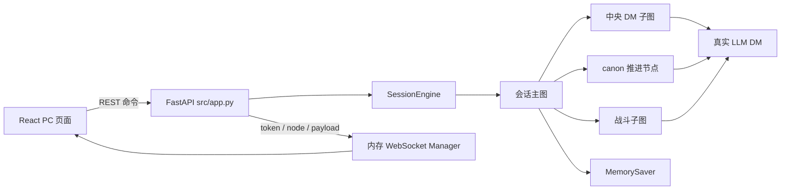
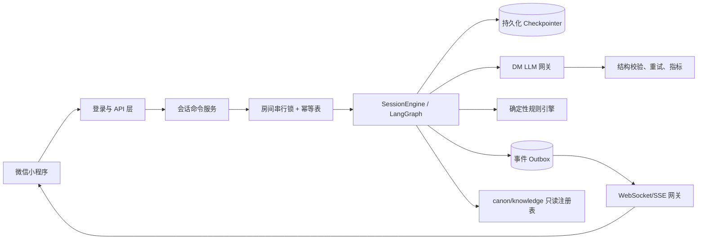

# 项目现状评审与改进路线

> 评审基线：2026-07-14。
> 评审范围：`src/`、`front/pc-dnd-bot/`、`test/`、`canon/`、`knowledge/` 和现有 `docs/`。

## 一、结论

项目已经不是“只有战斗原型”的阶段。当前实际主线包含：

- `SessionEngine` 会话主图，串联中央 DM、明检定、故事推进和战斗子图。
- `/session/start`、`message`、`submit`、`state` 四个 HTTP 入口。
- WebSocket 节点生命周期、流式 token 和调试事件。
- 一个可在浏览器操作的 PC 端垂直切片。
- canon 加载、结构校验、剧情拍推进和结局。
- 由真实 LLM 执行的 DM 决策与叙述；规则结算仍由 Python 引擎负责。

当前瓶颈也因此发生了变化：**核心问题不再是“能不能跑”，而是会话是否能安全、稳定、可恢复地跑在真实用户和并发请求下。** 现状适合单进程演示，不适合直接发布为多人小程序服务。

近期不建议继续增加 Agent 数量或扩充完整 5e 规则面。应先完成会话基础设施、协议收口、真实模型评测和小程序闭环。

## 二、当前实现图



`src/graph.py` 和 `/invoke` 是另一条 deepagents 示例线，不是 D&D 主流程。它仍有硬编码输入和过时的多 Agent 文案，不能作为产品接口理解。

## 三、做得正确的部分

### 1. 领域边界清楚

“规则归引擎，叙述归 DM，骰子归玩家”的主方向是正确的。命中、伤害、HP、检定结果、先攻和胜负由确定性代码处理，LLM 不直接改数值。

### 2. 中断点位置合理

DM 决策节点与玩家掷骰中断分离。恢复中断时不会重新调用前置 DM 决策，避免重复收费和重复裁定。

### 3. 会话状态有统一门面

`SessionEngine` 把图运行结果归一为 `awaiting_input`、`interrupted`、`finished`，这适合继续演化成稳定的前端协议。

### 4. 剧情结构不是完全交给模型

canon 负责拍、出口、结局和白名单 flag，确定性条件由引擎判断，semantic 条件被收窄成是/否题。相比让 LLM 自由改剧情状态，这更可控。

### 5. 已经有可验证的垂直切片

“开场 -> 对话 -> 明检定 -> 战斗 -> 回到剧情 -> 结局”的大部分构件都已存在。下一阶段应围绕这条链做可靠性和体验验证，而不是另建一套架构。

## 四、问题清单

### P0：发布小程序前必须解决

| 问题 | 代码现状与影响 | 改进方案 | 验收标准 |
| --- | --- | --- | --- |
| 会话没有身份认证和房间授权 | API 和 WebSocket 都信任客户端传入的 `user_id`、`room_id`。任何人知道房间号即可读取、发消息或恢复中断。 | 用小程序登录态换服务端 session/token；服务端从 token 取 user，不接受客户端自证身份；每条命令校验房间成员和 `directed_to.user_id`。 | 越权读房间、替别人掷骰、伪造 user 均返回 401/403。 |
| 存档和连接都是进程内状态 | `MemorySaver` 和 WebSocket 映射都在当前进程。重启丢局，多实例无法共享，滚动发布会断线。 | 使用官方支持的持久化 checkpointer；增加会话元数据表；WebSocket 广播改用共享事件总线或黏性会话；应用 lifespan 负责资源启停。 | 重启后可恢复到同一中断，多实例请求不会读到不同状态。 |
| 同房间命令可并发执行 | `message`、`submit` 没有房间锁、幂等键或版本检查。双击、重试、两台设备可能让同一回合执行两次。 | 命令携带 `request_id`、`expected_revision`；服务端按 room 串行执行并做幂等去重；响应返回新 revision。 | 重放同一请求只产生一次结算；过期 revision 返回 409。 |
| 骰子随机源是进程级单例 | `src/combat/dice.py` 的 `_ENGINE_DICE` 会被任意房间的开局/战斗重置。并发房间会互相改变随机序列，无法可靠回放。 | 将 `Dice` 变成 session/combat 作用域依赖；随机状态或 roll 序号进入 checkpoint；DM 骰子工具从当前运行上下文获取实例。 | 两个房间交错运行与分别运行得到相同日志；不存在跨房间污染。 |
| 刷新恢复协议不完整 | 前端保存 roomId 却不在启动时调用 state；`GET /state` 返回裸内部 state，并移除了 `__interrupt__`，刷新后无法恢复当前待办掷骰。 | 提供统一 `SessionView` 查询，包含 status、pending interrupt、revision 和公开状态投影；前端启动先恢复，再连接事件流。 | 在任意中断页面刷新，仍显示同一个行动/掷骰面板。 |
| 玩家伤害骰会静默改由引擎掷 | 普通命中未回传 `damage_result` 时引擎自动掷；重击中断提交空对象也自动掷。PC UI 的“交给引擎结算”与项目原则冲突。 | 明确房间骰子策略：虚拟骰由玩家点击后服务端产生并回填，实体骰由玩家录入；不能用缺字段触发静默回退。 | 玩家控制角色的每次要求掷骰都有来源记录，缺少合法结果时返回 422，不推进状态。 |

### P1：MVP 质量问题

#### 1. LLM 输出校验仍有静默修正

`world_bridge` 会把非法 ability/kind 改成默认值、把非法 DC 改成 12；`judge_trigger` 对非布尔值使用 `bool(...)`，字符串 `"false"` 会被当成真；叙述空字符串也可能被写入消息。

建议为每类 DM 输出建立严格 Pydantic schema：

- 解析失败、类型错误、非法枚举进入有限次数的真实 LLM 重试。
- 重试仍失败则显式报错，不推进 checkpoint。
- DC 限制到产品声明的范围，并记录裁定理由、模型、耗时和 token。
- 叙述必须非空，不合格时仍只允许真实 LLM 重试，不使用模板回退。

#### 2. 世界位置存在双重真相

`moved_to` 更新 `story.current_location_id`，但没有同步重建 `scene.location_id/location/description/exits`。后续 DM 仍可能看到旧场景。`clues_delivered` 也没有按当前 canon 线索 ID 做白名单校验。

建议让引擎提供单一 `apply_world_transition()`：校验同拍可达性、更新 story、从 `LocationSpec` 重建 scene 投影、产出事件。DM 只声明意图，不能直接写场景字典。

#### 3. API 泄漏内部状态结构

响应把 `DMState`、dataclass 和调试字段整体编码给前端。内部字段一改，前端就可能破坏；多人后还可能暴露不应给玩家看的信息。

建议增加版本化公开 DTO：

```text
SessionView
  session_id, revision, status
  campaign, scene_public, party_public, enemies_public
  timeline[], pending_interaction, recent_resolution
```

checkpoint 状态、DM 工作区、canon 秘密和系统提示词不得进入普通玩家响应。

#### 4. REST 与 WebSocket 有竞态

同一最终 payload 既从 HTTP 返回，又通过 WebSocket 推送；事件没有 `event_id/request_id/revision`。多标签页还会因为固定 `user_aria` 和未校验 `room_id` 接收其他房间的数据。

建议明确职责：REST/命令通道只确认命令接收和最终 revision；事件通道按 room 发送有序事件。前端 reducer 按 revision 去重，收到旧事件直接丢弃。

#### 5. 前端仍是演示页

`App.tsx` 同时承担网络、事件归并、业务状态、调试器和所有 UI；行动面板只渲染攻击、移动、放弃，技能、道具、创意动作没有入口；没有断线重连、心跳、自动滚动、历史分页和刷新恢复。

建议先抽出 `sessionApi`、`sessionStore/reducer`、`eventClient`、`AdventureTimeline`、`PendingInteraction`，再复用这些领域层到小程序。不要直接把 785 行组件移植过去。

#### 6. 测试依赖真实模型且断言脆弱

现有 flow 测试期望模型必然触发指定检定/战斗，同时注释仍声称存在离线启发式 DM。这既与运行时约束冲突，也会因模型方差导致 CI 不稳定。

测试应分四层：

1. 纯规则单测：dice parser、命中、HP、行动合法性、canon trigger。
2. 图协议测试：在测试代码中注入受控 DM provider，验证中断/恢复和状态迁移。测试替身不能进入运行时路径。
3. API 合约测试：鉴权、幂等、revision、公开 DTO、断线恢复。
4. 真实模型评测：单独的手动或夜间任务，评估裁定一致性、叙述事实性、延迟和成本，不作为每次提交的确定性单测。

### P2：进入多人或扩大内容前解决

#### 1. 明确“简化 D&D”规则版本

当前战斗只覆盖区域距离、基础攻击、少量技能/道具和简单状态，不是完整 5e。缺少完整行动经济、优势/劣势、抗性、死亡豁免、专注、法术和借机攻击等。

短期应把产品标为“基于 D&D 的简化规则”，冻结 MVP 规则清单，并让 UI 只展示引擎真正支持的动作。不要在文案上承诺完整 5e。

#### 2. 内容生产缺少工具链

目前只有一个 canon 和较薄的 knowledge。建议增加 canon schema、编辑校验 CLI、资产清单、剧情回放和静态检查；新剧本必须验证所有拍可达、胜败结局存在、actor/card/flag/clue 引用有效。

#### 3. 遗留入口和文档会误导维护

- `/invoke` 忽略请求的 `user_input/thread_id`，内部使用硬编码值。
- `src/graph.py` 顶部描述未实现的多 Agent 流程。
- `docs/待改进问题.md` 和 `docs/下一步可玩垂直切片方案.md` 部分结论已过期。
- 评审时 `.env.example` 缺少完整配置；现已改为 MySQL 配置加多供应商 `LLM_*` 模型目录。

建议将 `/invoke` 和 `src/graph.py` 标为开发示例或移出产品应用；补齐环境示例、健康检查、依赖分组、CI 和数据库迁移说明。

#### 4. 可观测性只有日志，没有产品指标

至少采集：每回合首 token/总耗时、各 LLM 调用耗时与 token、JSON 重试次数、断线次数、中断等待时间、每局完成率、空转回合、玩家放弃点。日志需带 `session_id/turn_id/request_id`，且不能记录密钥和隐藏剧情。

## 五、目标架构



关键约束：

- 命令修改状态，查询只返回公开投影，事件只通知已提交的 revision。
- 同一房间任一时刻只执行一个命令。
- LLM 决策通过严格 schema 后才能进入规则层。
- checkpointer、随机状态和事件序号共同保证恢复与回放。
- 不在生产路径加入离线 DM 或模板叙述。

## 六、推荐实施顺序

### 阶段 0：冻结基线，3-5 天

- 删除或隔离 `/invoke` 的产品暴露，修正文档和 `.env.example`。
- 建立公开 DTO、中断 schema 和错误码，不再直接返回内部 state。
- 补纯规则、canon、LLM schema 的单元测试。
- 建立真实模型基准剧本和延迟/成本记录表。

### 阶段 1：可靠会话，1-2 周

- 接入小程序登录鉴权和房间成员授权。
- 换持久化 checkpointer，完成应用生命周期管理。
- 增加 room lock、request id、revision、幂等处理。
- 把 Dice 隔离到 session/combat，上线交错并发测试。
- 完成刷新恢复、断线重连和统一事件 envelope。

### 阶段 2：小程序 MVP，1-2 周

- 按《小程序 UI 设计方案》实现冒险主屏、掷骰/行动底部面板、战斗状态和角色页。
- 支持静态场景资产映射、流式叙述、错误恢复和历史分页。
- 跑通单人“钟楼下的低语”完整浏览器外真机流程。

### 阶段 3：体验验证，持续 1 周以上

- 组织真实玩家完成至少 20 局，记录完成率、等待时间、卡关和裁定争议。
- 基于数据调整提示词、canon、DC 规则表和交互，不先扩完整规则书。
- 达到单人体验门槛后，再做邀请、房主、轮到谁、旁观广播和多人掉线恢复。

## 七、MVP 发布门槛

- 服务重启后可恢复到原中断，且不会重复结算。
- 同房间双击/重试/并发命令不会产生双写。
- 所有会话接口有鉴权和房间授权。
- 两个房间交错运行不会互相影响骰子序列。
- 玩家骰、怪物骰、DM 暗骰都有来源和日志。
- 刷新、切后台、断网恢复后能继续当前回合。
- LLM 非法 JSON、空叙述、超时都显式报错，不生成假 DM 内容。
- 小程序可从开局玩到胜/败结局，所有支持的行动都有可用 UI。
- 真实模型评测记录 P50/P95 首 token、回合耗时、重试率和单局成本。
